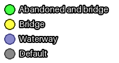
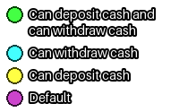
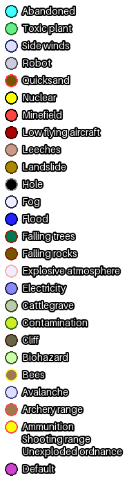
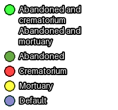
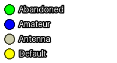

# overpass-queries

- [Usage](#usage)
- [Contents](#contents)
- [Development](#development)
- [See also](#see-also)
- [Licences](#licenses)

## Usage

1. Open a `.overpassql` file.
2. Copy and paste the contents of the file to [Overpass Turbo](https://overpass-turbo.eu/) or [Overpass Ultra](https://overpass-ultra.us/).
3. `*_in_area.overpassql`: Edit line #3 to write the area of search to the variable `search_area`. To find the id(s) of the area of search, [Nominatim](https://nominatim.openstreetmap.org/ui/search.html) or [admin_level_in_bbox](src/admin_level_in_bbox.overpassql) can be used.\
   `*_in_bbox.overpassql`: Move the map to the area of search.
4. Click `Run` in the top left corner.
5. `*_in_area.overpassql`: Click `zoom to data` on the map.

## Contents

| Query | Files | Style | Notes |
|--|--|--|--|
| Abandoned objects | [area](src/abandoned_in_area.overpassql) [bbox](src/abandoned_in_bbox.overpassql) |  | [Lifecycle prefixes](https://wiki.openstreetmap.org/wiki/Lifecycle_prefix#Stages_of_decay) |
| Administrative boundaries | [bbox](src/admin_level_in_bbox.overpassql) |  | [Country specific values ​​of the key `admin_level=*`](https://wiki.openstreetmap.org/wiki/Tag:boundary=administrative#Country_specific_values_%E2%80%8B%E2%80%8Bof_the_key_admin_level=*) |
| Bridges | [bbox](src/bridges_in_bbox.overpassql) |  | WIP |
| Bunkers | [area](src/bunkers_in_area.overpassql) [bbox](src/bunkers_in_bbox.overpassql) |  | |
| Caves | [area](src/caves_in_area.overpassql) [bbox](src/caves_in_bbox.overpassql) |  | |
| Cryptocurrency ATMs | [area](src/crypto_atms_in_area.overpassql) [bbox](src/crypto_atms_in_bbox.overpassql) |  | |
| Fixme | [area](src/fixme_in_area.overpassql) [bbox](src/fixme_in_bbox.overpassql) |  | [Key:fixme](https://wiki.openstreetmap.org/wiki/Key:fixme) |
| Hazards | [area](src/hazards_in_area.overpassql) [bbox](src/hazards_in_bbox.overpassql) |  | |
| Lighthouses and beacons | [area](src/lighthouses_in_area.overpassql) [bbox](src/lighthouses_in_bbox.overpassql) |  | |
| Localities | [area](src/localities_in_area.overpassql) [bbox](src/localities_in_bbox.overpassql) |  | [Tag:place=locality](https://wiki.openstreetmap.org/wiki/Tag:place%3Dlocality) |
| Mines and quarries | [area](src/mines_in_area.overpassql) [bbox](src/mines_in_bbox.overpassql) |  | |
| Mortuaries, crematoria and graveyards | [area](src/mortuaries_in_area.overpassql) [bbox](src/mortuaries_in_bbox.overpassql) |  | ‌‍‌‍‌‍‍‍‌‍‍‌‍‌‌‌█████ ‌‍‍‌‌‌‌‍████‌‍‍‍‌‍‌‌‌‌‍‌‌‌‌‌ ‌‍‍‌‌‌‌‍████‌‍‍‍‌‌‍‌‌‍‍‌‌‍‌‍‌‌‍‌‌‌‌‌ ‌‍‍‍‍‌‌‍‌‍‍‌‍‍‍‍‌‍‍‍‌‍‌‍█████‌‌‍‌‌‌‌‌‌‍‍‌‌‍‌‌‌‍‍‌‍‍‍‍‌‍‍‌‍‌‌‍‌‍‍‌‍‍‍‌‌‍‍‌‌‍‍‍‌‌‍‌‌‌‌‌ █████‌‍‍‌‍‌‌‌‌‍‍‌‌‍‌‍ ‌‍‍‍‌‌‍‌██‌‍‍‌‌‍‌‍ ████‌‌‍‍‍‍‍‍ ‌‌‌‌‍‌‍‌███ |
| Notes | [area](src/notes_in_area.overpassql) [bbox](src/notes_in_bbox.overpassql) |  | [Key:note](https://wiki.openstreetmap.org/wiki/Key:note) |
| Radio | [area](src/radio_in_area.overpassql) [bbox](src/radio_in_bbox.overpassql) |  | |
| Was | [area](src/was_in_area.overpassql) [bbox](src/was_in_bbox.overpassql) |  | [Key:was:*](https://wiki.openstreetmap.org/wiki/Key:was:*) |

## Development

### Requirements

- [Make](https://www.gnu.org/software/make/)
- [sed](https://www.gnu.org/software/sed/)
- [Python 3](https://www.python.org/)
- [Pillow](https://pypi.org/project/pillow/)

### Building

```bash
# Build everything
make

# Generate *_in_bbox.overpassql from *_in_area.overpassql
make in_bbox

# Generate style images
make styles
```

## See also

- [Overpass Turbo instances](https://wiki.openstreetmap.org/wiki/Overpass_Turbo#Instances)
- [Overpass Ultra instances](https://wiki.openstreetmap.org/wiki/Overpass_Ultra#Instances)
- [Public Overpass API instances](https://wiki.openstreetmap.org/wiki/Overpass_API#Public_Overpass_API_instances)
- [Language reference](https://wiki.openstreetmap.org/wiki/Overpass_API/Overpass_QL)
- [Map features](https://wiki.openstreetmap.org/wiki/Map_features)
- [Nominatim](https://nominatim.openstreetmap.org/ui/search.html)
- [Taginfo](https://taginfo.openstreetmap.org/)
- [TagFinder](https://tagfinder.osm.ch/)
- [Emacs mode](https://github.com/stygian-violet/overpassql-mode)
- [GeoJSON editor](https://geojson.io/)

## Licenses

- [`overpass-queries`](LICENSE)
